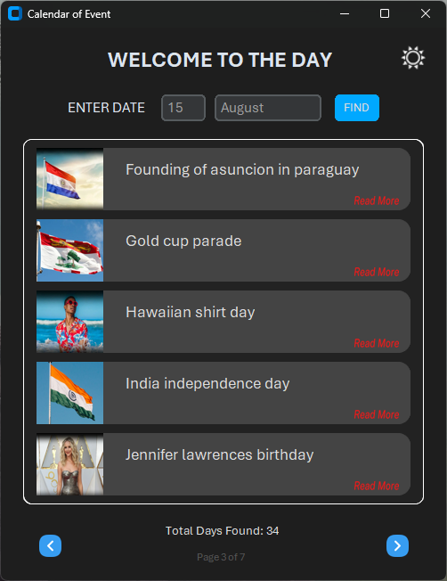

# 📆 Calendar of Event

**Calendar of Event** is a desktop-based daily calendar viewer that displays national and international observances, as well as celebrity birthdays for every day of the year. It supports offline mode, includes image-based UI, and supports pagination and date-based filtering.

---

## 🚀 Features

- Fully offline, no internet required
- Display entries (image + label) for each day
- Browse by date or use Left/Right buttons to view more
- Clean UI with light mode and icon-based navigation
- JSON-based data loading and fast search
- Installer available for distribution

---

## 📁 Project Structure

```

Calendar-of-Event/
│
├── Calendar of Event.py              # Main GUI application (Offline version)
├── Calendar of Event-online.py       # Optional online version (if applicable)
├── Calendar of Event.exe             # Standalone executable (for Windows)
│
├── Data\_Extractor.py                 # Script to extract + prepare data from raw images and save to JSON
├── json\_data.json                    # Raw name + position data (intermediate format)
├── title\_img\_pos.json               # Final data used by GUI (image name, label, position)
│
├── Icons/                            # All icon files (PNG, theme buttons, etc.)
│
├── Images/
│   └── Days Image/
│       └── Month/
│           └── Day/
│               └── \[images].jpg     # All images are saved in respective month/day folders
│
├── Output/
│   └── Calendar\_of\_Event\_Installer.exe  # Installer (user must manually copy 'Images' & 'Icons' after install)

````

---

## ⚙️ How to Run

### 🖥 Option 1: Run from Python source
1. Make sure you have Python 3.9+ and `customtkinter`, `Pillow` installed.
2. Run:
   ```python "Calendar of Event.py"```

3. All images will be displayed based on today’s date or your selected input.

---

### 🧰 Option 2: Run the `.exe` version

1. Go to `Output/` and run:

   ```
   Calendar_of_Event_Installer.exe
   ```
2. After install, manually **copy** the following folders to the installed directory:

   * `Images/`
   * `Icons/`

---

## 📦 Dependencies

* `customtkinter`
* `Pillow`
* Python 3.9 or above

To install:

```pip install customtkinter pillow```

---

## 📌 Notes

* The main GUI is handled by `Calendar of Event.py`
* Data is loaded from `title_img_pos.json` only
* `Data_Extractor.py` helps you prepare this data by merging image names, labels, and Y-position
* You can navigate entries using LEFT/RIGHT arrows, or enter a specific date manually

---

## 📸 Screenshots

#  Dark Mode

#  Light Mode


---

## 👤 Author

**Kartikey Baghel**
📍 India
🔧 BCA 2st Year | Passionate about Technology & Software Crafting

---

## 📜 License

This project is under the **MIT License**. Free to use, modify, and distribute.

---

Thanks for https://nationaltoday.com/ for Images and Name